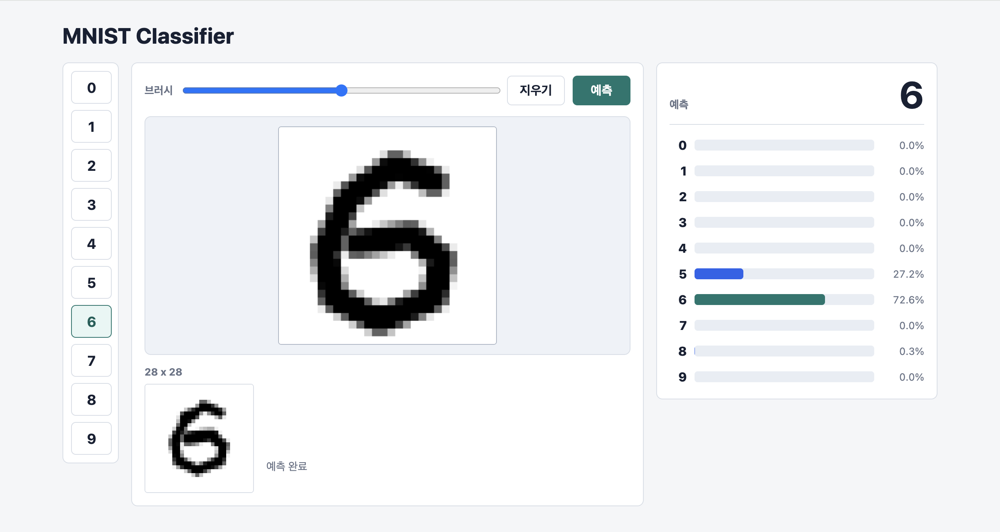

# MNIST Classifier

Java Spring Boot와 Deeplearning4j를 사용해 손글씨 숫자를 분류하는 MNIST 웹 애플리케이션입니다.  
브라우저 Canvas 입력을 `28 x 28` 픽셀 배열로 전처리하고, 서버에서 학습된 딥러닝 모델을 로드해 숫자와 확률을 예측합니다.

<br>

## Project Info

| 항목 | 내용                                             |
| --- |------------------------------------------------|
| 프로젝트명 | MNIST Classifier                               |
| 프로젝트 기간 | 2026.06.02 (1일)                                |
| 주요 목적 | 딥러닝 모델을 로드하고 웹 API로 서빙하는 Spring Boot App 구현 연습 |

<br>

## Why This Project

Spring Boot에서 AI를 어떻게 활용할 수 있는 지 학습하기 위한 간단한 프로젝트 입니다.

- ML 모델을 Spring Boot의 Service 계층에서 로드하고, Controller를 통해 API 호출
- 브라우저 Canvas 입력을 모델 입력 형식에 맞게 전처리
- 사용자 입력, API 요청, 모델 예측, 결과 시각화를 하나의 흐름으로 구현
- 모델 파일이 없을 때 학습하고, 이후 실행에서는 저장된 모델을 재사용

<br>

## Preview



<br>

## Features

- 모델 파일이 존재하면 로드하고, 없으면 학습 후 저장
- 브라우저 Canvas 기반 손글씨 숫자 입력
- Deeplearning4j `MultiLayerNetwork` 기반 숫자 예측
- 숫자 샘플 버튼을 통한 빠른 예측 테스트
- 숫자별 예측 확률 시각화

<br>

## Tech Stack

| 구분 | 기술 |
| --- | --- |
| Language | Java 21 |
| Backend | Spring Boot 3.5.14, Spring Web, Spring Validation |
| View | Thymeleaf |
| Machine Learning | Deeplearning4j, ND4J |
| Build Tool | Maven |
| Frontend | HTML, CSS, JavaScript, Canvas API |

<br>

## How It Works

1. 사용자가 Canvas에 숫자를 그립니다.
2. JavaScript가 숫자가 그려진 영역을 찾고 중앙 정렬합니다.
3. 이미지를 `28 x 28` 크기로 축소합니다.
4. 각 픽셀을 `0.0`부터 `1.0` 사이의 값으로 변환합니다.
5. `POST /api/mnist/predict` API로 픽셀 배열을 전송합니다.
6. 서버는 학습된 MNIST 모델로 숫자를 예측합니다.
7. 화면에 예측 숫자와 숫자별 확률을 표시합니다.

<br>

## Implementation Highlights

### Canvas Input Preprocessing

MNIST 모델은 `28 x 28` 의 입력 형식을 가집니다. Canvas로 구현하기에는 사이즈가 너무 작아, Canvas의 크기를 `280 x 280`으로 설정 하여, 모델의 입력값을 맞추기 위해 클라이언트에서 아래 전처리를 수행했습니다.

- 입력 영역에서 실제 획이 있는 경계 계산
- 숫자를 중앙에 배치
- `280 x 280` Canvas 이미지를 `28 x 28`로 축소
- 흰색 배경은 `0.0`, 검은색 획은 `1.0`에 가깝게 정규화

### Model Serving

서버는 애플리케이션 시작 시 모델 파일을 확인합니다.

- 기존 모델 파일이 있으면 `ModelSerializer`로 로드
- 모델 파일이 없으면 MNIST 데이터셋으로 학습 후 저장
- 예측 요청이 들어오면 `784`개 픽셀 값을 `INDArray`로 변환해 모델에 입력

### API Contract

예측 API는 안정적인 모델 입력을 보장하기 위해 요청값을 검증합니다.

- `pixels`는 반드시 존재해야 합니다.
- 배열 길이는 정확히 `784`여야 합니다.
- 각 값은 `0.0` 이상 `1.0` 이하의 숫자여야 합니다.

<br>

## Model

애플리케이션 시작 시 모델 초기화가 수행됩니다.

- `model/mnist-model.zip` 파일이 있으면 기존 모델을 로드합니다.
- 모델 파일이 없으면 MNIST 데이터셋으로 모델을 학습합니다.
- 학습이 완료되면 모델을 `model/mnist-model.zip`에 저장합니다.
- Early Stopping 중간 결과는 `model/early-stopping`에 저장합니다.

모델 구조는 다음과 같습니다.

| Layer | 설정 |
| --- | --- |
| Dense Layer 1 | `nIn=784`, `nOut=256`, `ReLU` |
| Dense Layer 2 | `nIn=256`, `nOut=128`, `ReLU` |
| Output Layer | `nIn=128`, `nOut=10`, `Softmax` |
| Optimizer | Adam |
| Loss Function | Negative Log Likelihood |

<br>

## API

### Predict Digit

```http
POST /api/mnist/predict
Content-Type: application/json
```

#### Request Body

```json
{
  "pixels": [0.0, 0.0, 0.12, 0.85, ...] 
}
```

`pixels` 배열은 `28 x 28 (784)4` 크기의 MNIST 이미지의 명암을 표현한 값을 1차원으로 나열한 값. 


- 길이: 정확히 `784`
- 값 범위: `0.0` 이상 `1.0` 이하
- 의미: `0.0`은 흰색, `1.0`은 검은색

#### Response Body

```json
{
  "prediction": 7,
  "probabilities": {
    "0": 0.001,
    "1": 0.002,
    "2": 0.004,
    "3": 0.011,
    "4": 0.003,
    "5": 0.006,
    "6": 0.001,
    "7": 0.940,
    "8": 0.025,
    "9": 0.007
  }
}
```

<br>

## Key Files

| 파일 | 역할 |
| --- | --- |
| `MnistModelService.java` | 모델 로드, 학습, 예측 처리 |
| `MnistController.java` | 예측 REST API 제공 |
| `MnistViewController.java` | MNIST 화면 렌더링 |
| `mnist.js` | Canvas 입력, 전처리, API 호출, 결과 렌더링 |
| `MnistPredictionRequest.java` | 예측 API 요청 형식 및 입력 검증 |
| `application.yaml` | 모델 파일 경로 설정 |

<br>

## What I Learned

- 프로젝트 흐름 이해: AI를 활용한 Spring Boot API로 서빙하는 전체 흐름을 이해함
- 자바 기반 AI 기술 습득: Deeplearning4j와 ND4J 이용한 신경망 설계 및 구축
- JavaScript를 통한 데이터 시각화: 예측 확률을 시각화해 결과를 직관적으로 표현


<br>

## Getting Started

### Requirements

- Java 21
- Maven Wrapper 사용 가능 환경

### Run

```bash
./mvnw spring-boot:run
```

애플리케이션 실행 후 브라우저에서 아래 주소로 접속합니다.

```text
http://localhost:8080/
```

### Test

```bash
./mvnw test
```

### Build

```bash
./mvnw package
java -jar target/mnist.jar
```

<br>

 
